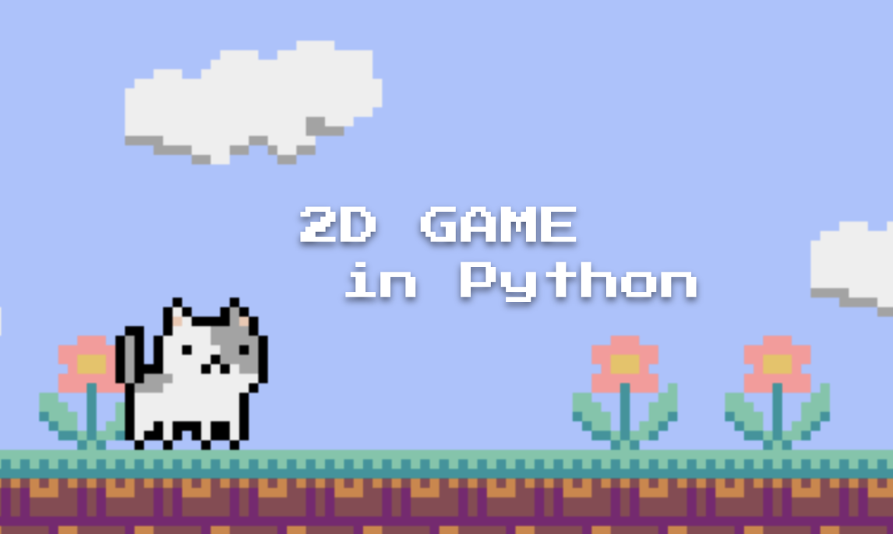

This was created during our time as a engineers-in-training at Code Chrysalis.
# 2Dgame in Python

This is a 2D game. You can play using a cat and collect apples and avoid bombs and enemies.

---
## How to play
After cloning this repository, you need to install python and pyxel.
1. install python (<a href="https://www.python.org/downloads/">here</a>)

2. install pyxel  
``
pip install pyxel
``

3. start to play  
``
python catGame.py
``

-----
## key config
- KEY-0: start game
- KEY-LEFT: move to left
- KEY-RIGHT: move to right
- KEY-SPACE: jump
- KEY-R: reset game
- KEY-Q: quit game

-----
## Uses
- Python
- pyxel
